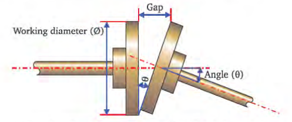
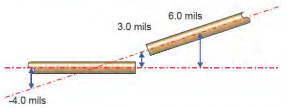
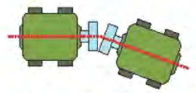
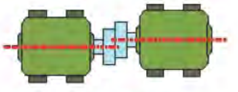

# Benchmark exercise MBADS for System Sizing: Coupling bolt

## 1. Glossary

|        Keyword        |   **Synonyms**   | **Definition**                                               |                          **Source**                          |
| :-------------------: | :--------------: | :----------------------------------------------------------- | :----------------------------------------------------------: |
|      Angularity       |                  | The angle between two rotating axes at a given point. The angularity is expressed in terms of a slope in mils/mm (gap per diameter). The angularity multiplied by the coupling diameter gives an equivalent gap difference at the coupling rim.  | [Source](https://backflowparts.com/wp-content/uploads/2021/06/Shaft_Alignment_Instructions.pdf) |
|        Offset         |                  | The distance between two rotating axes at a given point. Offset is measured in mm.  Offset is sometimes incorrectly referred to as parallel offset or rim misalignment. However, the shaft rotation axes are rarely parallel, and the coupling or shaft rim has an unknown relationship to the shaft rotation axes. The same alignment condition, the offset value varies depending upon the location where the distance between two shaft rotation ration axes is measured.   | [Source](https://backflowparts.com/wp-content/uploads/2021/06/Shaft_Alignment_Instructions.pdf) |
| Horizontal angularity | Gap per diameter |  The angle between the shaft rotating axes in the horizontal (plan view) at a given point. | [Source](https://backflowparts.com/wp-content/uploads/2021/06/Shaft_Alignment_Instructions.pdf) |
|   Horizontal offset   |                  |  The distance between the shaft rotating axes in the horizontal (plan view) at a given point. | [Source](https://backflowparts.com/wp-content/uploads/2021/06/Shaft_Alignment_Instructions.pdf) |
|  Vertical angularity  | Gap per diameter |  The angle between the shaft rotating axes in the vertical (side view) at a given point. | [Source](https://backflowparts.com/wp-content/uploads/2021/06/Shaft_Alignment_Instructions.pdf) |
|    Vertical offset    |                  |  The distance between the shaft rotating axes in the vertical (side view) at a given point. | [Source](https://backflowparts.com/wp-content/uploads/2021/06/Shaft_Alignment_Instructions.pdf) |

## 2. Introduction

This benchmark exercise aims to evaluate - competitive or complementary - contributions claiming to improve the Model-Based Architecture Design Synthesis (MBADS) process for system sizing. 

In this benchmark exercise, the overall objective of the Model-Based Architecture Design Synthesis Process is to size the Coupling Bolt System defined in Section 3. The candidate solutions can support an engineer throughout the end-to-end MBADS process or for a specific activity.

Section 4 specifies the design inputs for each activity of the MBADS process. All candidate solutions must reuse these design inputs to make fair comparisons.

- Section 4.1 defines the inputs of the Requirements Development activity.
- Section 4.2 defines the inputs of the Concept Finding activity.
- Section 4.3 defines the inputs of the Problem Modelling activity.
- Section 4.4 defines the inputs of the Problem Solving activity.

## 3. System-Of-Interest

The system-of-interest is a rigid flange Coupling Bolt System. A Coupling Bolt System is a mechanical means of holding two halves of a flanged shaft together to transfer the torque while maintaining shaft alignment.

## 4. Design Inputs

The design inputs are defined in a generic format, that is, without a specific modelling language and software, leaving the contributors to choose to use their preferred solutions for encoding the data.

### *4.1. Requirements Development*

- [ ] **Design Inputs:**
  - 1 system context
  - 1..* system functions
  - 1 system architecture
- [ ] **Design Outputs:**
- 1..* requirements
  
- 1..* design constraints

**Coupling Bolt System Context**

A system context includes the external environment in which the system must operate. The external environment includes external entities stakeholders with which the system must interact. For this benchmark exercise, we only consider the operational context of the Coupling Bolt System. A more exhaustive system analysis would also consider other contexts related to other phases of the Coupling Bolt System life cycle (e.g., maintenance phase) that are additional sources of constraints and functions.

**Coupling Bolt System Functions**

The Coupling Bolt System shall perform a set of functions:

|  ID  | Function                                                     |
| :--: | ------------------------------------------------------------ |
|  F1  | To transfer torque from the driving shaft to the driven shaft. |
|  F2  | To maintain the vertical angularity between the driving shaft and the driven shaft. |
|  F3  | To maintain the vertical offset between the driving shaft and the driven shaft. |
|  F4  | To maintain the horizontal angularity between the driving shaft and the driven shaft. |
|  F5  | To maintain the horizontal offset between the driving shaft and the driven shaft. |

### *3.2. Concept Finding*
**Coupling Bolt System Architecture**

The architecture of the rigid flange Coupling Bolt System is known.

### *4.2. Concept Finding*
- [ ] **Design Inputs:**
  - 1..* requirements
  
  - 1..* design constraints
  
- [ ] **Design Outputs:**
  - 1..* system configuration
  - A preliminary set of typed design variables with their range of acceptable values (e.g., min and/or max real number, Boolean, enumeration).
  - A preliminary set of design parameters, each with a fixed value set after a design synthesis iteration.
  - A preliminary set of constants, each with its unmodifiable value.
  - A preliminary set of relationships between design variables, design parameters, and constants

**Coupling Bolt System Requirements**

The table below specifies the requirements that the Coupling Bolt System must satisfy. The Coupling Bolt System specification is potentially incomplete compared to the design outputs obtained after benchmarking claimed contributions to the activity 4.1. Requirements Development. 

| ID   | Statement                                                    |
| ---- | ------------------------------------------------------------ |
| SR1  | The coupling bolt system shall transfer a torque greater than or equal to 400 N.m, when: - The rotating speed of the driving shaft is between 0 rpm and 4000 rpm, and - The outside air temperature is between 5°C and 50°C |
| SR2  | The coupling bolt system shall maintain the vertical angularity ..., when: - The rotating speed of the driving shaft is between 0 rpm and 4000 rpm, and - The outside air temperature is between 5°C and 50°C |
| SR3  | The coupling bolt system shall maintain the vertical offset ..., when: - The rotating speed of the driving shaft is between 0 rpm and 4000 rpm, and - The outside air temperature is between 5°C and 50°C |
| SR4  | The coupling bolt system shall maintain the horizontal angularity..., when: - The rotating speed of the driving shaft is between 0 rpm and 4000 rpm, and - The outside air temperature is between 5°C and 50°C |
| SR5  | The coupling bolt system shall maintain the horizontal offset ..., when: - The rotating speed of the driving shaft is between 0 rpm and 4000 rpm, and - The outside air temperature is between 5°C and 50°C |

**Coupling Bolt System Design Constraints**

The table below specifies the Coupling Bolt System Design constraints imposed by external entities (stakeholders or systems).

| ID   | Statement                                                 |
| ---- | --------------------------------------------------------- |
| C1   | The coupling bolt system must be purely mechanical.       |
| C2   | The cost of the coupling bolt system must be minimized.   |
| C3   | The weight of the coupling bolt system must be minimized. |
| C4   | The diameter of the shaft is equal to 50 mm.              |

### *4.3. Problem Modelling*

- [ ] **Design Inputs:**
  - 1..* system configuration
  - Preliminary set of constants, each with its unmodifiable value.
  - Preliminary set of typed design variables with their range of acceptable values (e.g., min and/or max real number, Boolean, enumeration).
  - Preliminary set of design parameters, each with a fixed value set after a design synthesis iteration.
  - Preliminary set of relationships between design variables, design parameters, and constants.

- [ ] **Design Outputs:**
  
  - Complete set of design variables, design parameters, and constants.
  
  - Complete set of relationships between design variables, design parameters, and constants.

**Coupling Bolt System Configuration**

The Coupling Bolt System configuration is known in advance as the objective of the MBADS is system sizing. As shown below, the Coupling Bolt System includes at least one bolt and one shaft, and exactly one material.

**Preliminary Set of Constants**

| Name | Data Type | Domain | Unit | Definition |
| :--: | :-------: | :----: | :--: | :--------: |
|      |           |        |      |            |

**Preliminary Set of Design Parameters**

| Name |   Data Type   |  Domain  | Unit |          Definition           |
| :--: | :-----------: | :------: | :--: | :---------------------------: |
|  Mt  | Positive real | 40 00 00 | N.mm |  Minimum torque to transfer   |
|  Nm  | Positive real |    8     |  -   |    Minimum number of bolts    |
|  ep  | Positive real |    10    |  mm  |           Thickness           |
|  Rm  | Positive real |    50    |  mm  | Radius of housing shafts (mm) |

**Preliminary Set of Design Variables**

|  Name  |    Data Type     |     Domain     | Unit |               Definition               |
| :----: | :--------------: | :------------: | :--: | :------------------------------------: |
|   N    | Positive integer | [\| Nm, 100\|] |  -   |            Number of bolts             |
|   R    |  Positive real   |   [10;1050]    |  mm  |            Coupling radius             |
|   Rb   |  Positive real   |    [5;1000]    |  mm  |              Bolt radius               |
|   b    |  Positive real   |     [5;50]     |      |  Radial width of the contact surface   |
|   s    |  Positive real   |    [1;100]     |  mm  |         Distance between bolts         |
|  Bref  | Positive integer | Cf Table below |  -   |             Bolt reference             |
| Maccou |  Positive real   |                |      | Total mass of the coupling bolt system |
|  Coût  |  Positive real   |                |      | Total cost of the coupling bolt system |
|   M    |  Positive real   |   [Mt, 1 E7]   | N.m  |     e transferred by the coupling      |

**Table of bolt references**

| Num  |  d   |   ds   |   d2   |  p   |  bm   |  sm   |  dt  |
| :--: | :--: | :----: | :----: | :--: | :---: | :---: | :--: |
|  1   |  6   | 5.062  | 5.350  | 1.00 | 7.50  | 14.50 | 6.6  |
|  2   |  8   | 6.827  | 7.188  | 1.25 | 9.50  | 18.50 | 9.0  |
|  3   |  10  | 8.593  | 9.026  | 1.50 | 12.50 | 23.50 | 11.0 |
|  4   |  12  | 10.358 | 10.863 | 1.75 | 13.50 | 26.50 | 13.5 |
|  5   |  14  | 12.124 | 12.701 | 2.00 | 15.50 | 29.50 | 15.5 |
|  6   |  16  | 14.124 | 14.701 | 2.00 | 17.00 | 32.00 | 17.5 |
|  7   |  20  | 17.655 | 18.376 | 2.50 | 21.00 | 40.00 | 22.0 |
|  8   |  24  | 21.185 | 22.051 | 3.00 | 25.00 | 48.00 | 26.0 |

 

### *4.4. Problem Solving*

- [ ] **Design Inputs:**
  - Complete set of relationships between design variables, design parameters, and constants.

- [ ] **Design Outputs:**
  - 1..* values for design variables.

**Complete set of Constants**

**Complete set of Design Parameters**

| Name |   Data Type   |  Domain  | Unit |          Definition           |
| :--: | :-----------: | :------: | :--: | :---------------------------: |
| *Mt* | Positive real | 40 00 00 | N.mm |  Minimum torque to transfer   |
| *Nm* | Positive real |    8     |  -   |    Minimum number of bolts    |
| *ep* | Positive real |    10    |  mm  |           Thickness           |
| *Rm* | Positive real |    50    |  mm  | Radius of housing shafts (mm) |

**Complete set of Design Variables**

|   Name   |    Data Type     |     Domain     | Unit |               Definition               |
| :------: | :--------------: | :------------: | :--: | :------------------------------------: |
|   *N*    | Positive integer | [\| Nm, 100\|] |  -   |            Number of bolts             |
|   *R*    |  Positive real   |   [10, 1050]   |  mm  |            Coupling radius             |
|   *Rb*   |  Positive real   |   [5, 1000]    |  mm  |              Bolt radius               |
|    b     |                  |                |      |                                        |
|    s     |                  |                |      |                                        |
|   Bref   | Positive integer |    Cf Table    |  -   |             Bolt reference             |
| *Maccou* |  Positive real   |                |      | Total mass of the coupling bolt system |
|  *Coût*  |  Positive real   |                |      | Total cost of the coupling bolt system |
|   *M*    |  Positive real   |   [Mt, 1 E7]   | N.mm |   Torque transfered by the coupling    |

**Bolts:**

$$
N ≥N_m \tag{1}
$$
 **Geometric model:**

$$
R= R_b+ b \tag{2}
$$

$$
s=2×π×R_b/N								\tag{3}
$$

$$
R_b= R_m+b	   								\tag{4}
$$

$$
A_s= π × d_s^2/4	 		 						\tag{5}
$$

$$
R_b  ≥ R_m+b									 \tag{6}
$$

$$
s≥s_m										\tag{7}
$$

$$
b≥b_m										\tag{8}
$$

**Mechanical stress Von Mises:**

$$
M=N×R_b  × f_m × F0_{mini}   						\tag{9}
$$

$$
F0_{maxi}= α_s  × F0_{mini}       							\tag{10}
$$

$$
σ_{max}=  F0_{maxi}/A_s 	    								\tag{11}
$$

$$
τ_{max}=16C_1/(π.d_s^3)	 							\tag{12}
$$

$$
C_1= F0_{maxi}×(0.16×p+0.583×d_2×f_1)					\tag{13}
$$

$$
σeq_{max}= √[σ_{max}^2+3×τ_{max}^2]						\tag{14}
$$

$$
0.9×R_e≥σeq_{max}  								\tag{15}
$$

$$
M≥M_T	    								\tag{16}
$$

**Mass model:**

$$
M_{accou}=  π/2×e_p×(ρ_j×(4×R_b×b_m-N×d_t^2 )+ρ_v×N×d^2) 		\tag{17}
$$

$$
ρ_j=2.710^{-6}kg.mm^{-3} 								\tag{18}
$$

$$
ρ_v=7.810^{-6}kg.mm^{-3} 								\tag{19}
$$

**Cost model:**

$$
C_{accou}=K_1×d+K_2×N 							\tag{20}
$$

$$
K1 = 0.6 euros/mm								\tag{21}
$$

$$
K1 = 0.6 euros/mm								\tag{22}
$$

## References

- Yvars, P. A., & Zimmer, L. (2021). A model-based synthesis approach to system design correct by construction under environmental impact requirements. *Procedia CIRP*, *103*, 85-90.

- Yvars, P. A., Lafon, P., & Zimmer, L. (2009). Optimization of mechanical system: Contribution of constraint satisfaction method. In *2009 International Conference on Computers & Industrial Engineering* (pp. 1379-1384). IEEE.

- Roucoules, L., Lafon, P. et al. (2006). Knowledge intensive approach towards multiple product modelling and geometry emergence to foster cooperative design. In: Proceedings of the CIRP Design Seminar, Kananaskis

- https://backflowparts.com/wp-content/uploads/2021/06/Shaft_Alignment_Instructions.pdf

  