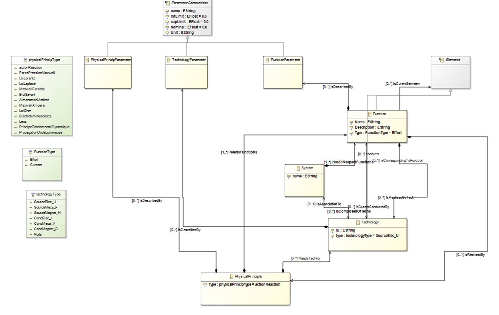

# #OO1 Lean Engineering

> Metadata:
>
> - Authors: Lionel Roucoules
> - Version: V1
> - License: CC-BY-SA

| Design Philosophy | Design  Method |  Modelling  Language   | Modelling  Software |          Modelling  Method          |
| :---------------: | :------------: | :--------------------: | :-----------------: | :---------------------------------: |
| Lean engineering  |  FPPT and SK2  | FPPT and SK2 Ecore DSL |       Eclipse       | FPPT-SK2 with Ecore DSL and Eclipse |

## Design philosophy

The main approach is therefore presented in three main steps:
- A Function-Behaviour-Structure modelling for mapping function to structure via physical principles. That phase initiates the design process and provides the first product information (functional surfaces, physical principles and structural data).
- A multiple points of view modelling for knowledge-intensive design. That model allows the integration of expert knowledge and supports the relation among this information.
- A decision-making process.

## Design method

Models concepts (figure 5) are issued from IDEFØ and bond-graphs theory and goals at:
- Function specification via the conduction or the isolation of energetic flows representation.
- Structural representation as system, sub-system or part. That intrinsically gives the product breakdown.
- Functional surface representation. Those surfaces support energetic flow conduction and are then justified by the least commitment.

That first design phase of the proposed design approach provides what the author calls minimal “usage” information that is then used as input for embodiment design. That information concerns:

- Functional, physical and technological parameters and associated relations with respect to the technology selection process. Those parameters give a formal relation among the functional, physical principles and structural domains that can be very beneficial in case of redesign (ex: to know the impact of a functional change on the structural solution and vice versa).
- Functional required surfaces. Those surfaces do not represent a complete product geometry. The product has not, at this stage, a sufficient definition to be manufactured.

### External Functional Analysis

### FPPT

### SK2

## Modelling language

### External functional analysis

[Click here to download the TDC Need functional analysis model](../Proposals/FPPT-SK2/Sources/) -> MODEL IS MISSING

### FPPT Ecore

- [ ] [Click here to download the FPPT UML profile](../Proposals/FPPT-SK2/Sources/FPPT.ecore)

### SK2 Ecore

- [ ] [Click here to download the SK2 UML profile](../Proposals/FPPT-SK2/Sources/SK2.ecore)

## Modelling software

Eclipse

- [ ] [Click here to download Eclipse Version...]()

- [ ] [Click here to download the SK2 model of the Coupling Bolt System](../Proposals/FPPT-SK2/Sources/)

## Modelling method

## References

- Jean-Sébastien, K. M., Guilain, C., Pascal, L., Nadčge, T., Lionel, R., & Thierry, G. (2007). Product Modelling for Design Alternatives Selection Using Optimisation and Robustness Analysis. *Guidelines for a Decision Support Method Adapted to NPD Processes*.
- Skander, A., Roucoules, L., & Klein Meyer, J. S. (2008). Design and manufacturing interface modelling for manufacturing processes selection and knowledge synthesis in design. *The international journal of advanced manufacturing technology*, *37*, 443-454.
